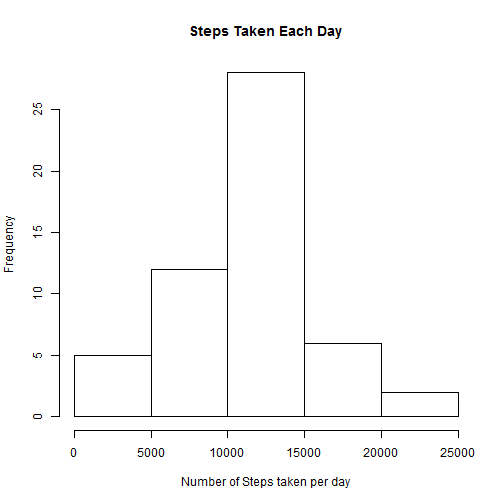
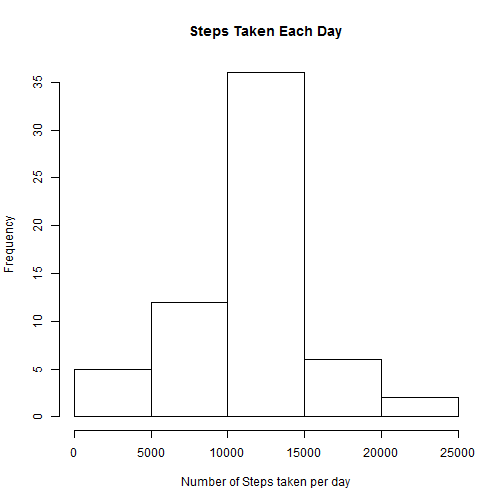

# Reproducible Research: Peer Assessment 1


## Loading and preprocessing the data

```r
library("graphics")
library("timeDate")
```

```
## Warning: package 'timeDate' was built under R version 3.0.3
```

```r
library("lattice")
```

```
## Warning: package 'lattice' was built under R version 3.0.3
```

```r
activity <- read.csv("~/GitHub/RepData_PeerAssessment1/activity/activity.csv")
# View(activity) aggregate the number of steps by date
s1 = aggregate(steps ~ date, data = activity, FUN = sum)
aggrByInterval = aggregate(steps ~ interval, data = activity, FUN = mean)
```


## What is mean total number of steps taken per day?
#### 1. Make a histogram of the total number of steps taken each day

```r
# 1. create a histogram of the total number of steps taken eacn day
hist(s1$steps, xlab = "Number of Steps taken per day", main = "Steps Taken Each Day")
```

 


#### 2. Calculate the mean and median total number of steps taken per day

```r
mean1 = sapply(s1["steps"], mean, na.rm = TRUE)
print(paste("mean of steps taken = ", mean1))
```

```
## [1] "mean of steps taken =  10766.1886792453"
```

```r
# 
median1 = sapply(s1["steps"], median, na.rm = TRUE)
print(paste("median of steps taken=", median1))
```

```
## [1] "median of steps taken= 10765"
```


## What is the average daily activity pattern?
#### 1. Make a time series plot of the 5-minutes interval and the avg number of steps taken 

```r
plot(aggrByInterval, type = "l")
```

 

#### 2. Which 5-minute interval on avg across all the days in the dataset, contains the maximum number of steps?

```r
print(paste("Interval with the max number of steps = ", aggrByInterval[aggrByInterval["steps"] == 
    max(aggrByInterval["steps"]), 1]))
```

```
## [1] "Interval with the max number of steps =  835"
```


## Imputing missing values
#### 1. Calculate and report the total number of missing values in the dataset ( i.e the total number of rows with NA)


```r
ok = complete.cases(activity)
print(paste("Number of rows with missing values = ", sum(!ok)))
```

```
## [1] "Number of rows with missing values =  2304"
```

```r

# just to confirm there are no rows with missing date or interval
sum(is.na(activity$date))
```

```
## [1] 0
```

```r
sum(is.na(activity$interval))
```

```
## [1] 0
```

#### 2. the strategy to fill the missing values is to use the mean of steps taken for that interval

#### 3. create a new dataset that is equal to the original dataset but with missing data filled in using the strategy from step 2


```r
completeActivity = activity
for (i in 1:nrow(activity)) {
    if (is.na(activity[i, "steps"])) {
        int1 = activity[i, "interval"]
        completeActivity[i, "steps"] = aggrByInterval[which(aggrByInterval["interval"] == 
            int1), "steps"]
    }
}
# confirm that there no more rows with missing values
ok = complete.cases(completeActivity)
print(paste("Number of rows with missing values = ", sum(!ok)))
```

```
## [1] "Number of rows with missing values =  0"
```

#### 4. Make a histogram of the number of steps taken each day and calculate the mean and median total number of steps taken per day.

```r
# aggregate the number of steps by date
s2 = aggregate(steps ~ date, data = completeActivity, FUN = sum)
hist(s2$steps, xlab = "Number of Steps taken per day", main = "Steps Taken Each Day")
```

 

```r

# aggrByInter2 = aggregate(steps ~ interval, data = completeActivity,
# FUN=mean)
mean2 = sapply(s2["steps"], mean, na.rm = TRUE)
print(paste("mean of steps taken = ", mean2))
```

```
## [1] "mean of steps taken =  10766.1886792453"
```

```r
# 
median2 = sapply(s2["steps"], median, na.rm = TRUE)
print(paste("median of steps taken=", median2))
```

```
## [1] "median of steps taken= 10766.1886792453"
```

```r

print(paste("Mean with missing values =", mean1, " vs mean with missing values replaced by the mean for respective interval = ", 
    mean2))
```

```
## [1] "Mean with missing values = 10766.1886792453  vs mean with missing values replaced by the mean for respective interval =  10766.1886792453"
```

```r

print(paste("Median with missing values =", median1, " vs mean with missing values replaced by the median for respective interval = ", 
    median2))
```

```
## [1] "Median with missing values = 10765  vs mean with missing values replaced by the median for respective interval =  10766.1886792453"
```

#### Since the data is missing for an entire day, replacing the missing values with the respective mean for the interval did not impact the mean or median for the day

## Are there differences in activity patterns between weekdays and weekends?
#### 1. Create a new varable called weekday in the completeActivity dataset

```r
completeActivity$weekday = isWeekday(completeActivity$date)
```


```r
aggrByIntervalWeekday = aggregate(steps ~ interval + weekday, data = completeActivity, 
    FUN = mean)
```


#### 2. Make a panel plot containing a time series plot of the 5-minute interval and the average number of steps taken, averaged across all weekday day or weekend days 

```r
aggrByIntervalWeekday$weekend = ifelse(aggrByIntervalWeekday$weekday, "Weekday", 
    "Weekend")
xyplot(steps ~ interval | weekend, data = aggrByIntervalWeekday, type = "l", 
    layout = c(1, 2))
```

 

